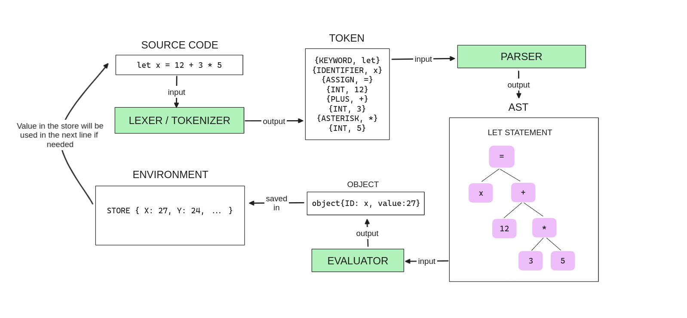

# THE INTERPRETER



## Description
This is an interpreter created to learn how programming languages ​​such as Python, Javascript, and others are created. It is much simpler than the languages ​​already mentioned. This Interpreter is based on the book [Writing An Interpreter in Go](https://interpreterbook.com/).


### Technologies
- Interpreter entierly written in [Go](https://go.dev/)
- Playground built with [Streamlit](https://streamlit.io/), to make UI easier

### Challenges
- Always tripped up with off-by-one errors
- Small functions often cause jumping around when reading the code. (but sometimes it helps)
- Recursion is sometimes difficult to explain. This interpreter use a lot of recursion.
- Extending the feature of programming language is challenging.


## Table of Contents
- [THE INTERPRETER](#the-interpreter)
  - [Description](#description)
    - [Technologies](#technologies)
    - [Challenges](#challenges)
  - [Table of Contents](#table-of-contents)
  - [Playground](#playground)
  - [Getting Started with the language](#getting-started-with-the-language)
    - [Variable](#variable)
    - [Data Type](#data-type)
    - [Function](#function)
    - [Conditional](#conditional)
    - [Loop](#loop)
    - [Examples](#examples)
  - [Development](#development)
  - [License](#license)
  - [Credits](#credits)


## Playground

This interpreter can be tried on Playground, which is available online [here](https://labasubagia-interpreter.streamlit.app/),along with several examples [here](/example/)

## Getting Started with the language

Several feature currently available in the language.

### Variable

```
let x = 10 + 5 * 2;
x = 50;
puts(x);
```
> **Limitation**: variable name only alphabetical

### Data Type
```
let x = 10;
let y = false;
let arr = [1, 2, 3, "abc", false];
let hash = {"a":  12, 5: "a", false: 12};
puts(x, y, arr[1], hash[false]);
```
> **Limitation**: `float` currently not supported

### Function
```
let fib = fn(n, cache) {
    if (n <= 0) {
        return 0;
    }
    if (n <= 2) {
        return 1;
    }
    if (cache[n]) {
        return cache[n];
    }

    let res = fib(n-1, cache) + fib(n-2, cache);
    cache[n] = res;
    return res;
}

let cache = {}
let x = fib(100, cache);

puts(x);
```

### Conditional
```
if (2 > 3) {
    puts("hurray");
} else {
    puts("ok")
}
```
> **Limitation**: `else if` currently not supported.

### Loop

```
let arr = [1,2,3,4,5];

let i = 0
while (i < len(arr)) {
    puts(arr[i] * arr[i]);
    i = i + 1;
}

```

Loop also possible using recursion.

```
let map = fn(arr, f) {
    let iter = fn(arr, accumulated) {
        if (len(arr) == 0) {
            return accumulated;
        }
        return iter(
            rest(arr),
            push(accumulated, f(first(arr)))
        );
    };
    return iter(arr, []);
};


let filter = fn(arr, f) {
    let iter = fn(arr, accumulated) {
        if (len(arr) == 0) {
            return accumulated;
        }

        let x =  first(arr);
        if (f(x)) {
            accumulated = push(accumulated, x);
        }
        return iter(rest(arr), accumulated);
    };
    return iter(arr, []);
};


let arr = [1,2,2,3,4];
puts("original", arr);

let filtered = filter(arr, fn(x) { x == 3 });
puts("filtered", filtered);

let squared = map(arr, fn(x) { x * x });
puts("squared", squared);

```

> **Limitation**: `for-loop` currently not supported.


### Examples

See more [here](/example/). You can check the _test file if you are even more curious.

## Development

If you want to develop this interpreter even more follow this step

1. Install Go Programming language

2. Install python to develop playground

   1. Install Python

   2. Install pip

   3. move to [playground directory](./interactive/)

   4. Init virtual environment

        ```sh
        $ python3 -m venv venv
        $ source ./venv/bin/activate
        ```

   5. Install all required packages
        ```sh
        $ pip install -r requirements.txt
        ```
   6. Run playground
        ```sh
        $ streamlit run main.py
        ```
3. Install pre-commit

   1. Read installation [here](https://pre-commit.com/)

   2. Install pre-commit hook to project
        ```sh
        $ pre-commit install
        ```

## License
[MIT](./LICENSE)

## Credits
Thorsten Ball, author of [Writing An Interpreter in Go](https://interpreterbook.com/).
